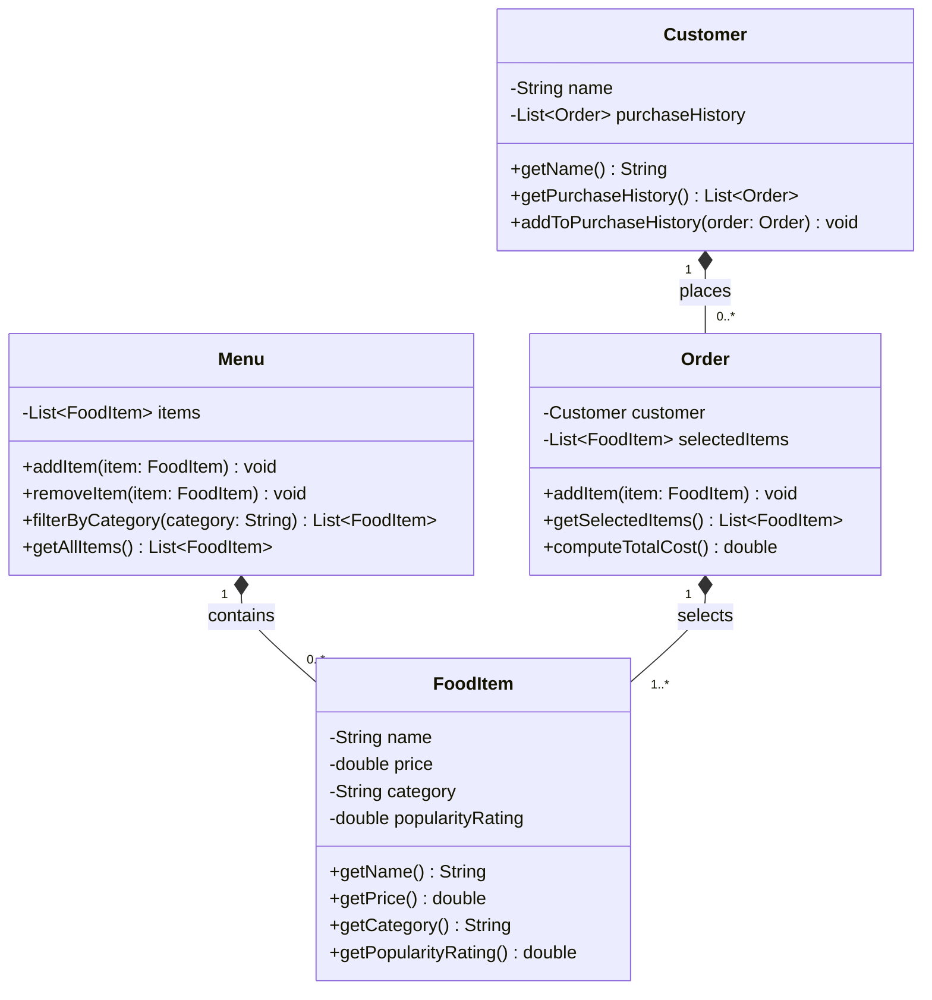

# ByteBites Backend — UML Class Diagram (Draft)

Based on the four candidate classes identified in `bytebites_spec.md`: **Customer**, **FoodItem**, **Menu**, and **Order**. Attributes and methods below are derived directly from the Client Feature Request section.

## Class Notes

### Customer
- **Purpose**: Represents a user of the app; verifies real/returning users.
- **Attributes**: `name` (identifies the customer), `purchaseHistory` (list of past `Order`s — satisfies "tracking their names and their past purchase history").

### FoodItem
- **Purpose**: Represents a single sellable item (e.g., "Spicy Burger", "Large Soda").
- **Attributes**: `name`, `price`, `category`, `popularityRating` — directly matches "name, price, category, and popularity rating for every item we sell."

### Menu
- **Purpose**: The digital collection of all available `FoodItem`s.
- **Attributes**: `items` — the full list of `FoodItem`s.
- **Key method**: `filterByCategory(category)` — matches "lets us filter by category such as 'Drinks' or 'Desserts'."

### Order
- **Purpose**: A single transaction grouping the items a customer selected.
- **Attributes**: `selectedItems` — the `FoodItem`s chosen; `customer` — links the order back to the purchasing `Customer` (supports `Customer.purchaseHistory`).
- **Key method**: `computeTotalCost()` — matches "compute the total cost."

## Relationships
All relationships are modeled as **composition** (filled diamond) — each owning object fully owns the lifecycle of the objects it holds.
- **Customer *-- Order** (1 to many): a customer owns its accumulated orders, forming their purchase history.
- **Menu *-- FoodItem** (1 to many): the menu owns and manages the full set of food items.
- **Order *-- FoodItem** (1 to many): an order owns the food items selected within it.
